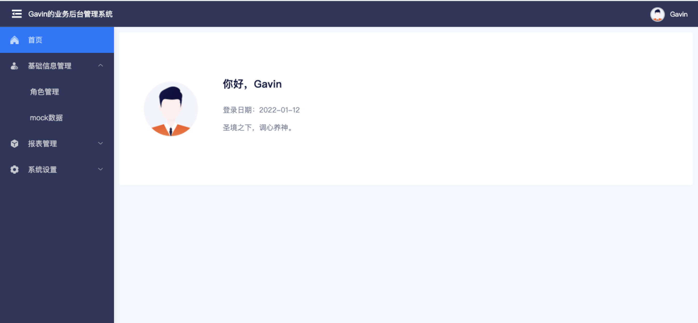

## Layout(递归菜单)

整体布局，头部是系统及个人信息，侧边栏是菜单，中间是内容区。

菜单使用了**递归菜单**，具体数据格式如下：

```js
const menu = [
  {
    id: 'account_manage',
    name: '账户管理',
    children: [
      {
        id: 'account_list',
        name: '账户列表'
      }
    ]
  }
]
```

## 效果图

