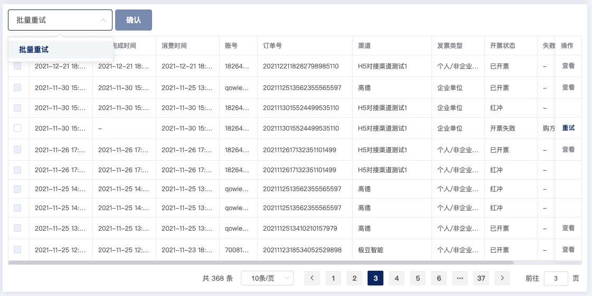
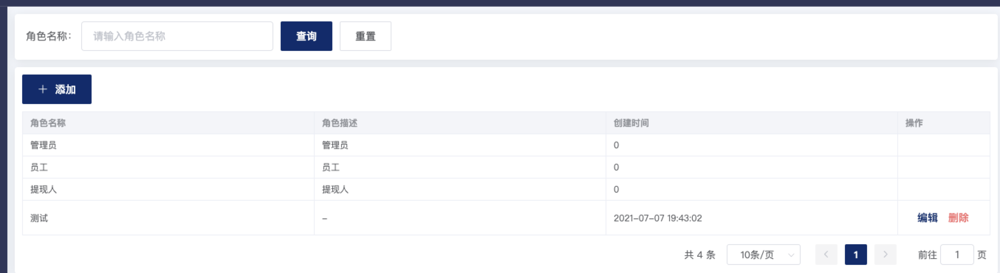

## 目录

该组件包含以下几个文件：

- index.vue
- computed.ts
- props.ts
- typings.ts

## index.vue

index 是项目的**核心组件** ，里面包含了搜索、列表、分页、导入、导出，跳转、批量操作、单行数据操作等。组件内部添加了大部分注释，方便理解。组件在扩展一些功能的同时，保留了 element 组件原有的属性方法。扩展的功能请查看组件注释及 props 介绍。

基本数据请求在 `store/modules/data.ts` 文件夹中，请求包括：搜索项、权限、列表，其中有个 `count` 属性，是因为列表的一些操作依赖搜索和权限数据，所以在  `index.vue` 监听到搜索和权限 api 完成后再进行列表数据的请求，具体逻辑需要研究明白是怎样操作的。

:::tip
  业务后台搜索项较多，可以考虑加上搜索区域**折叠**或者**可配置显示个数**，另外当列表过长的**自定义表头**显示等
:::

## computed.ts

获取 vuex 中有关列表的状态数据，比如，请求列表 data、loading、请求参数 params、权限 roles、多选数据 multipleSelection 等

## props.ts

集成组件 `table-page` 扩展的和常用的属性以及方法

## typeings.ts

组件部分的类型声明

## 部分功能效果图

