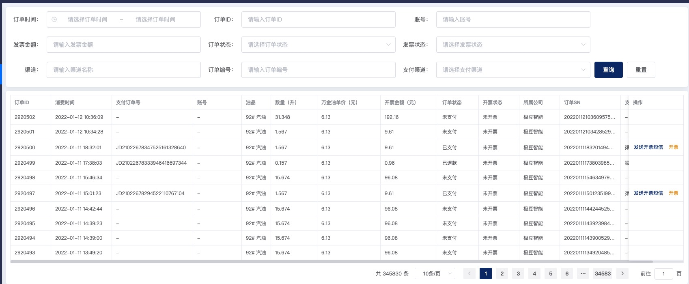

## 搜索项类型

后台 api 在返回搜索项的同时，会告知前端该项的类型，类型包括：complex（级联搜索项，例如：省市区）、text、number、select（单选）、multi_select（多选）、auto_complete（远程搜索）、date（日期选择）、date_range | time_range（日期范围）

## 搜索项数据接口（参考）
``` js
const data = [
  {
    hint: "请选择订单时间"           // placeholder
    id: "orderCreateTime"
    name: "订单时间"                // label 文本
    paramName: "orderCreateTime"   // 搜索项的绑定值
    type: "time_range"             // 搜索项类型
  }
]
```
:::warning
组件中对“查询”和“重置”都做了处理，至于传参格式，需要根据自己情况修改逻辑。
:::
## 部分效果图

